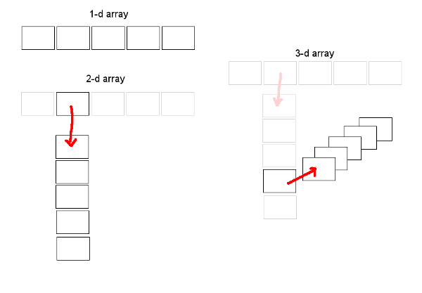

# Arrays

An Array is used to store multiple values in a single variable, instead of declaring separate variables for each value.

## Types of Arrays

There are 3 types of an array in C++ :

 1. One-dimensional array
 2. Two-dimensional array
 3. Multidimensional array (3D and more)

## 1D - One-dimensional array

A 1D Array is a list of elements given a name.

A typical declaration for an array in C++ is:
type name [elements];

// Single-braces - C++11 Support

    int num[4]{1, 2, 3, 4};
    double dnum[2]{0.5, 1.5};

OR

// Double-braces required in C++11

// num is an array of 4 int values

    std::array<int, 4> num{{1,2,3,4}};
    std::array<double, 2> dnum{{0.5, 1.5}};
    std::array<float, 3> fnum{{0.5, 1.5, 4.5}};

## 2D - Two-dimensional array

A 2D Array is a table of elements given a name.

2D Array is:

    int array2d[2][3]{{1,2,3},{4,5,6}};

    [2] - No. of rows: 2
    [3] - No. of Columns: 3 (1,2,3)

This array has 2 rows and 3 columns, which is why we have two rows of elements with 3 elements each.

## 3D - Three-dimensional array

A 3D array is a collection of 2D arrays given a name.

3D Array is:

    int array3d[3][3][1]{{1,2,3},{4,5,6},{7,8}};

    [3] - No. of rows: 3
    [3] - No. of Columns: 3 (1,2,3)
    [1] - Size of next Table of Elements (1) (7,8)

## 4D - Four-dimensional array

A 4D array is a array of a 3D array given a name.

4D Array is:

    int array4d[4][3][1][1]{{1,2,3},{4,5,6},{7,8},{9,10}};

    [4] - No. of rows: 4
    [3] - No. of Columns: 3 (1,2,3)
    [1] - Size of 2nd Elements Table (1) (7,8)
    [1] - Size of 3rd Elements Table (1) (9,10)