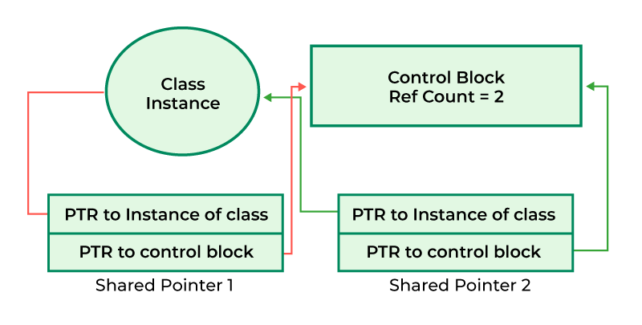
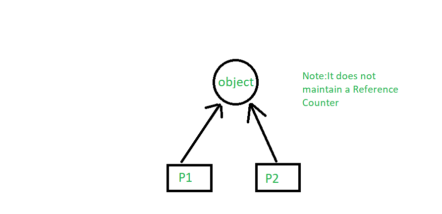

# Smart Pointers

## What is a Smart pointer?

A **smart pointer** is an **abstract data type (ADT)** that simulates a pointer while providing added features, such as **automatic memory management or bounds checking.** When a **smart pointer** is no longer in use, the memory it points to is **deallocated.**

## Why use Smart Pointers?

**Smart Pointers**:

1. **Smart pointers**, in plain terms, are **classes that wrap a pointer, or scoped pointers.**
2. It destroys itself when it goes **out of its scope.**
3. Smart pointers are more efficient as they have an additional **feature of memory management.**
4. They are **automatic/pre-programmed** in nature.

## Using Smart Pointers

It's best to use Smart Pointers over Normal Raw Pointers.
There are 3 types of Smart pointers.

1. **unique_ptr** - stores **one pointer only**. We can assign a different object by removing the current object from the pointer.
2. **shared_ptr** - **more than one pointer** can point to this one object at a time and it’ll maintain a **Reference Counter** using the use_count() method.
3. **weak_ptr** -  is a smart pointer that holds a **non-owning reference** to an object.

## Unique Pointer - unique_ptr

A **Unique pointer** models an **object** that has exactly **one owner** at any given **time**.

There is no need to call **delete** or **clean the memory** in an explicit manner. The **unique pointer** will take care of it once it goes **out of scope.**

## Shared Pointer - shared_ptr

A **Shared Pointer** has **more than one pointer** can point to this one object at a time and it’ll maintain a **Reference Counter** using the **use_count() method.**

## Weak Pointer - weak_ptr

A weak pointer is a pointer that holds a **non-owning ("weak") reference** to an object that is managed by **std::shared_ptr.** It acts as an **observer** in not participating in **reference counting** to delete an object or extend its **lifetime.**

